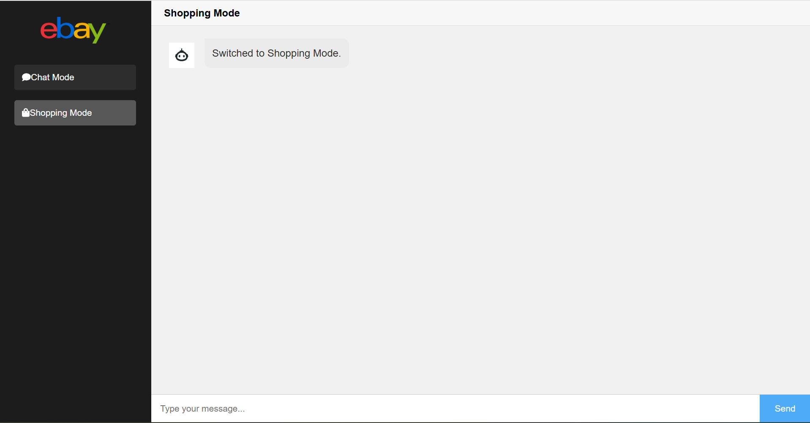

# My eBay Chatbot Project

Welcome to **My eBay Chatbot Project** – an intelligent, NLP-powered chatbot built to help users search for and compare products on eBay. The project features two main modes:
- **Chat Mode:** Engage in natural language conversations powered by OpenAI’s GPT (gpt-3.5-turbo).
- **Shopping Mode:** Use TF-IDF, clustering, and semantic search techniques to find the best product matches.

> **Visit Our Documentation Page:**  
> For detailed instructions and developer notes, refer to the [Project Report](docs/ebay%20chatbot%20report.pdf).

## Important Notice
**WARNING:**  
This project is designed to work with a specific file and folder structure. The Flask application and its associated HTML, JavaScript, and Python code rely on predetermined file paths (for example, in the `static/` folder for your HTML files and `src/` for your Python code). **If you change the repository structure, ensure that you update all relevant file paths in your code** (including in Flask routes, `send_from_directory()` calls, and any relative file references).  
   
Changing the structure without proper updates may prevent the Flask application from accessing necessary files (such as `index.html`, CSS, JS, or image assets) and cause runtime errors.

## Table of Contents

- [Overview](#overview)
- [Features](#features)
- [Repository Structure](#repository-structure)
- [Installation and Setup](#installation-and-setup)
- [Usage](#usage)
- [API Endpoints](#api-endpoints)
- [Requirements](#requirements)
- [Contributing](#contributing)
- [License](#license)
- [Acknowledgements](#acknowledgements)

## Overview

**My eBay Chatbot Project** is designed to enhance the shopping experience by providing an eBay shopping assistant. It assists users in finding relevant products by leveraging both natural language processing and a fast product search engine.

## Features

- **Dual-Mode Chatbot:**  
  Toggle between a natural language chat mode (using OpenAI’s GPT) and a product search mode (using TF-IDF, clustering, and semantic search).

- **Product Search:**  
  Retrieve matching products quickly from an eBay product catalog using advanced text processing techniques.

- **API Integration:**  
  Smooth integration with OpenAI's GPT for context-aware conversational responses.

- **Web-Based User Interface:**  
  A Flask-based web interface featuring a sidebar for mode selection, chat bubbles, and responsive design elements.

- **Extensive Documentation:**  
  Complete project report and supporting HTML pages are provided.

## Repository Structure

my_ebay_chatbot_project/ ├── data/ │ └── Final_updated_ebay_catalog.csv # eBay product catalog data ├── docs/ │ └── ebay chatbot report.pdf # Detailed project report ├── images/ │ ├── Website-Page.png # Banner image (displayed in README) │ ├── ebay_logo.png # eBay logo │ ├── shopping_cart.png # Shopping cart icon │ ├── user_icon.png # User icon │ ├── Chat mode result - 1.png # Chat mode screenshot │ ├── Chat mode result - 2.png │ ├── Shopping mode result - 1.png # Shopping mode screenshot │ └── Shopping mode result - 2.png ├── src/ │ ├── Ebaygpt.ipynb # Jupyter Notebook version (optional) │ ├── ebaygpt.py # Python code version (from Colab) │ ├── Flask code - tfidf.py # Flask app (TF-IDF vectorization) │ ├── Flask code - vec2vec.py # Flask app (semantic search with FAISS) │ ├── Main flask code - tfidf and clustering.py # Flask app (TF-IDF + KMeans clustering) │ └── Testing flask code.py # Flask testing code (if used) ├── static/ │ ├── index.html # Main landing page served by Flask │ ├── INDEX1-test.html # Sample HTML page │ └── INDEX2-test.html # Another HTML page sample ├── .gitignore # Git ignore rules (see below) ├── LICENSE # MIT License file ├── README.md # Project documentation (this file) └── requirements.txt # Python dependencies

## Installation and Setup

**Clone the Repository:**

   bash
   git clone https://github.com/venky1408/my_ebay_chatbot_project.git
   cd my_ebay_chatbot_project

**Create a Virtual Environment (Recommended):**
   
    bash
    python -m venv venv
    source venv/bin/activate         # On Windows: venv\Scripts\activate

**Install Dependencies:**

    bash
    py pip install -r requirements.txt

**Configure Application:**
   
    -Update file paths, API keys, and any hardcoded values in your Flask/Python code (in src/).
    -Make sure Final_updated_ebay_catalog.csv is in the data/ folder.

**Usage:**

    Running the Chatbot:
    Run one of the main Flask applications. For example, to use the TF-IDF and clustering version:
   
    bash
    python src/Main\ flask\ code\ -\ tfidf\ and\ clustering.py
    You may also choose other implementations (tfidf.py, vec2vec.py, etc.) depending on your mode.

**Accessing the UI:**

    -Open your browser and navigate to http://127.0.0.1:5000 to interact with the chatbot.
   
    -Switching Modes: Use the sidebar buttons in the web interface to switch between Chat Mode and Shopping Mode.

**Viewing Additional Documentation:**
    
See the project report in docs/ebay chatbot report.pdf and sample HTML pages in the static/ folder.

**API Endpoints**:

/chat

Accepts: JSON with message and optional chat_history.

Returns: A GPT-generated response along with updated chat history.

/search

Accepts: JSON with query, optional max_price, and file_path.

Returns: Top matching products from the catalog.

**Requirements**
This project requires Python 3.7+ and the following Python libraries:

    Flask>=2.0.0
    
    requests>=2.25.0
    
    nltk>=3.6.0
    
    scikit-learn>=0.24.0
    
    sentence-transformers>=2.2.2
    
    hdbscan>=0.8.27
    
    faiss-cpu>=1.7.2
    
    openai>=0.27.0
    
    ipywidgets>=7.6.5

Install these with:

    bash
    pip install -r requirements.txt
    Tip: After confirming everything works, you can pin exact versions using pip freeze > requirements.txt.

Contributing
Contributions are welcome! Please fork the repository, create a feature branch, make your changes, and submit a pull request with a detailed description.

License
This project is licensed under the MIT License. See the LICENSE file for full details.

Acknowledgements
Thanks to the developers of Flask, scikit-learn, nltk, OpenAI, and other libraries used in this project.Special thanks to the eBay developer community and our contributors for their insights and support.

For more detailed project documentation and insights, please refer to our Project Report.

For any additional instructions or troubleshooting, please refer to the relevant code comments or reach out via GitHub issues.
